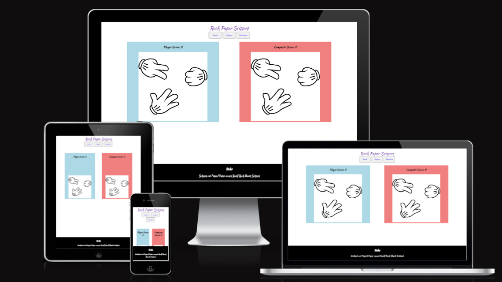
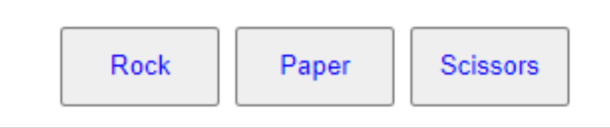
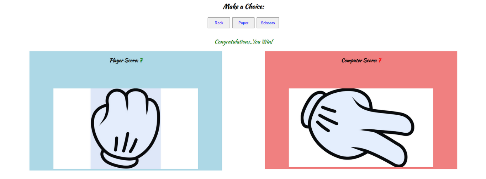
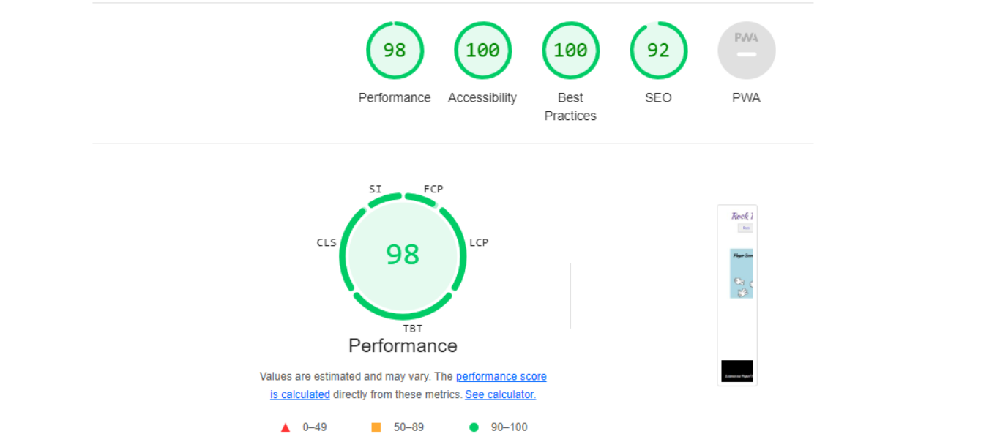
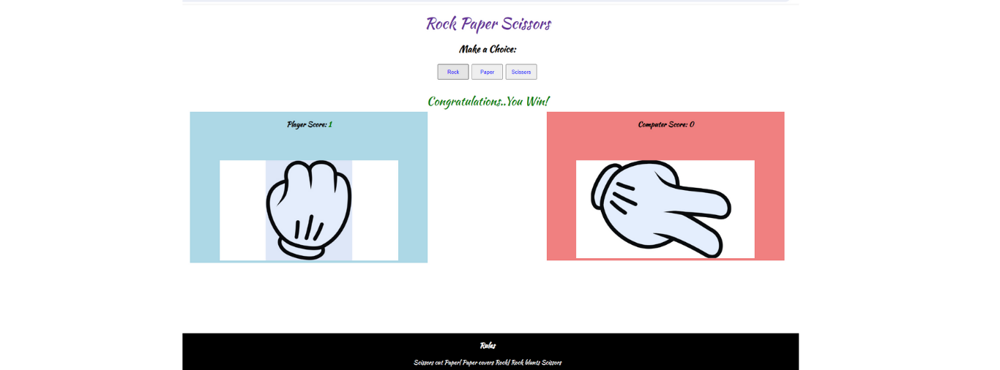
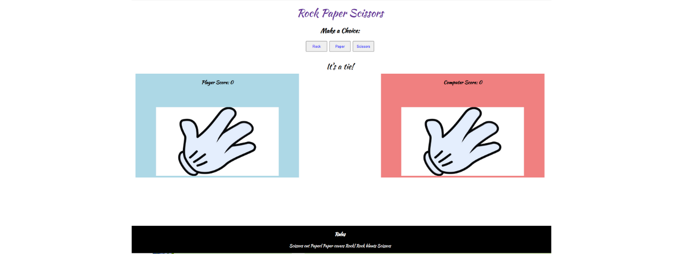
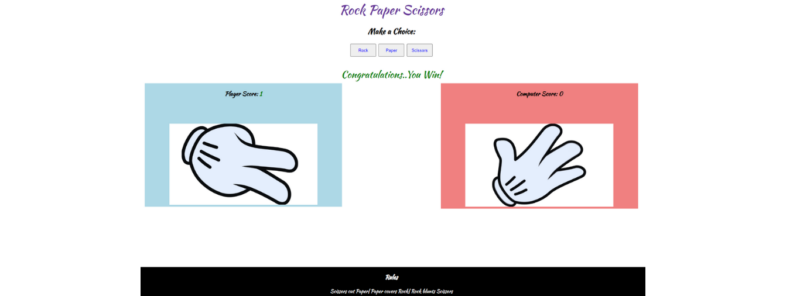

# •Rock Paper Scissors

[View website Here!](https://hills007.github.io/Rock-Paper-Scissors/)

•Rock paper scissors is an intransitive hand game, usually played between two people, in which each player simultaneously forms one of three shapes with an outstretched hand. These shapes are "rock" (a closed fist), "paper" (a flat hand), and "scissors" (a fist with the index finger and middle finger extended, forming a V). It is normally played between friends, colleagues and family to make a decision. 

•It has been shown that similar people are more likely to draw in this but playing agaist the computer has proven to be more fairer as the computer choses randomley than that played with hands.This site will be targeted towards adults and kids alike as a simple app to learn and have fun with it.

 ## Features:
### Header
•Featured at the top of the page is the header that shows the name of the game: Rock Paper scissors in kaushan cursive font that looks joyfull with rebecca purple color that clearly contrasts with the background

•This header clearly tells the user what game they are playing.

### Game Options 
•The Game options include a clear instruction and then a choice of options to choose from to play: Rock, Paper or Scissors. These options are interactive buttons that the user click to make their choice.

•This section provides interactive buttons that the user can click to make their choice and play the game.

### Game Results
•When the user clicks an option, the image relating to their choice is shown on their side of the game board.

•The Javascript code choses a random option for the computer player and displays the image relating to the computer's choice and determines the winner

•The winner is announced to the user under the options button and the score is updated for either the user in green text or the computer in red text depending on who won.

•The results and score are clear to the user , making the game easy to play, understand who won and what the score is.

### Footer
•The footer shows the rules of the game.

•It is valuable to the user because it clearly explains how the game is played.

    

### Future Features

•I would like to implement, Rock, Paper , Scissors, Lizard, Spock in the furture given the time.

## Testing:

•I tested playing this game in different browsers: chrome, explorer, firefox, Safarai.

•I confirmed that the game results are always correct.

•I confirmed that the header, instructions, options, results and footer text are all readable and easy to understand.

•I confirmed that the colors and fonts chosen are easy to read and accessible by running it through lighthouse in devtools.

•I confirmed that this project is responsive, looks good and functions on all standard screen size using the devtools device toolbar.

### Rock

•By testing the Rock boutton, when clicked, it shows player image of a fist with the outcome of the game under the buttons and an image of the computer choice of either Rock, Paper or scissors and the scores for both player and computer updating depending on the outcome

 

### Paper

•By testing the Paper boutton, when clicked, it shows player image of a flat hand with the outcome of the game under the buttons and an image of the computer choice of either Rock, Paper or scissors and the scores for both player and computer updating depending on the outcome

 

### Scissors

•By testing the Rock boutton, when clicked, it shows player image of a fist with the index finger and middle finger extended, forming a V, with the outcome of the game under the buttons and an image of the computer choice of either Rock, Paper or scissors and the scores for both player and computer updating depending on the outcome

 

## Bugs 

### Solved bugs

•When i deployed my project and clicked on an option, the image selection would not appear. I then changed my data-choice value in the html file from 0,1,2 to Rock, Paper and scissors and then it started working properly.

## Validator Testing 

#### HTML

•No errors were found when passed through the official W3C validator.

#### CSS

•No errors were found when passed through the official Jigsaw validator.

#### JavaScript

•No errors were found when passed through the official JHint validator.

## •Deployment:

The site was deployed to GitHub pages. The steps to deploy are as follows:

a.In the GitHub repository, navigate to the Settings tab

b.From the source section drop-down menu, select the Master Branch

c.Once the master branch has been selected, the page will be automatically refreshed with a detailed ribbon display to indicate the successful deployment.

The live link can be found below

(https://hills007.github.io/Rock-Paper-Scissors//)

## Credits

•I took the main idea for this game from the code institute portfolio project where majority of the css and html code was mentioned along with some of the javascript code. 

## Media

•The images were taken and downloaded from google. 

